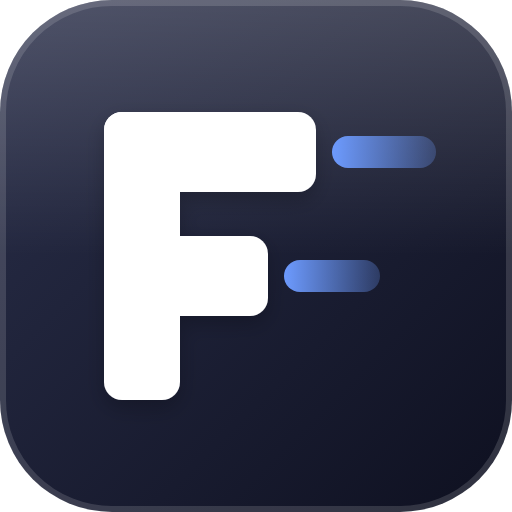
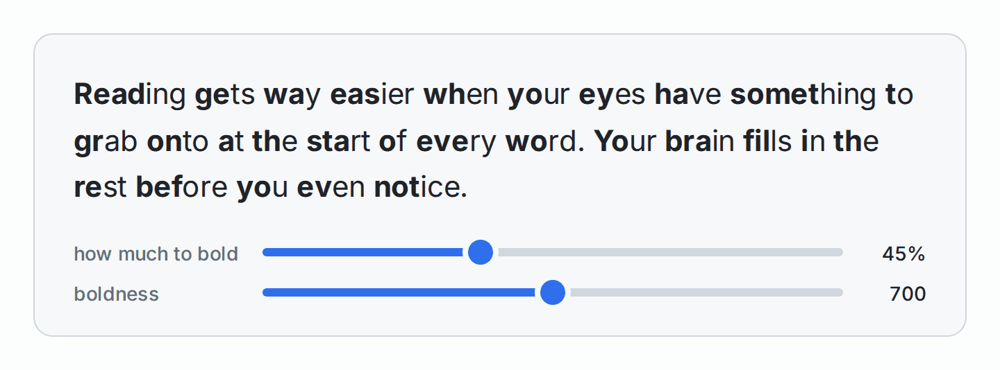

  

<h1 align="center">fixlexic</h1>

bionic reading for chrome. runs fully local, zero network access

 

bionic reading made text scanning feel effortless, but i wanted an extension that wasn't shipped with malware

## what it looks like

normal:

> Reading gets way easier when your eyes have something to grab onto at the start of every word. Your brain fills in the rest before you even notice.

with fixlexic:

<picture>
  <source media="(prefers-color-scheme: dark)" srcset="assets/sample-dark.png">
  
</picture>

you can change how much of each word gets bolded and how heavy it is:

<picture>
  <source media="(prefers-color-scheme: dark)" srcset="assets/demo-dark.gif">
  
</picture>

## install

you have to load the extension yourself, here's how

1. download this repo, go to `chrome://extensions` and turn on developer mode
2. hit **load unpacked** and pick the folder

## using it

- on for every site by default
- `alt+b` turns it off/on for whatever site you're on, and it remembers
- click the icon for the sliders
    - how much to bold: 30% to 70%, default 45
    - boldness: 500 to 900, default 700

## how it works

every word gets `ceil(length × ratio)` letters bolded. always at least 1, never the whole word. at 45% thats:

| word length | bolded |
| ----------- | ------ |
| 1 to 2      | 1      |
| 3 to 4      | 2      |
| 5 to 6      | 3      |
| 7 to 8      | 4      |

it skips code blocks, text boxes, anything youre typing in, and stuff thats already bold. also catches text that loads in later like infinite scroll

## permissions

chrome will say it can "read and change all your data on all websites". thats just what it takes to bold text on any page, no way around it. besides that its only `storage` (your settings) and `activeTab` (the shortcut). no fetch, no analytics, no remote anything. dont take my word for it, `content.js` is short

## doesnt work on

- `chrome://` pages and the web store (chrome blocks every extension there)
- chromes built in pdf viewer
- google docs (its drawn on a canvas, not real text)

## fyi

the research on bionic reading is pretty mixed, it helps some but it's harmless to try
